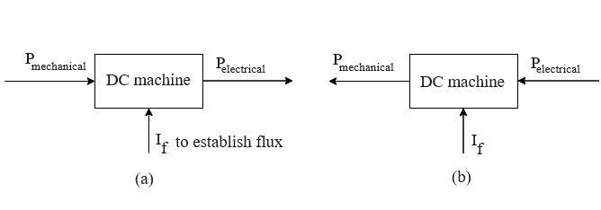

## Introduction

<b>Discipline | <b> Electrical Engineering 
:--|:--|
<b> Lab | <b> **Control and Instrumentation Lab**
<b> Experiment|     <b> **Study and operation of the DC speed and position control setup and Experiment 10**

### About the Experiment 
**DC Motors :**

The dc machine serves dual roles as both a generator and a motor, as depicted in Fig. 1. When functioning as a generator, mechanical power is supplied to the machine as input, yielding electrical power as output. A prime mover, such as a gas turbine, diesel engine, or electrical motor, spins the armature of the dc machine, generating dc power within it. Conversely, when utilized as a motor, electrical power is fed into the machine, resulting in mechanical power output. If the armature connects to a dc power source, the motor generates mechanical torque and power. Notably, the dc machine finds more frequent application as a motor rather than a generator. DC motors offer precise control over a wide range of speeds and torque. In both generator and motor modes, the armature winding rotates within a magnetic field, carrying current.

<b>Fig. 1. Reversibility of a dc machine. (a)Generator. (b)Motor.</b>                  

<b>Subject matter expertise | <b> **Prof. Alok Kanti Deb**
:--|:--|
<b> Institute | <b>  **Indian Institute of Technology Kharagpur**
<b> Email id|     <b>  **alokkanti@ee.iitkgp.ac.in**
<b> Department |  **Department of Electrical Engineering**
<b>Webpage| <b> http://www.iitkgp.ac.in/department/EE/faculty/ee-alokkanti

### Contributors List

SrNo | Name | VLabs Developer or Integration Engineer | Designation | Department| Institute
:--|:--|:--|:--|:--|:--|
1 | **Piyali Chattopadhyay** | Developer | Project Scientist | Department of Electrical Engineering | IIT Kharagpur | 
2 | **Subhasis Mahata** | Integration Engineer | Senior Project Scientist | Department of Mechanical Engineering | IIT Kharagpur |