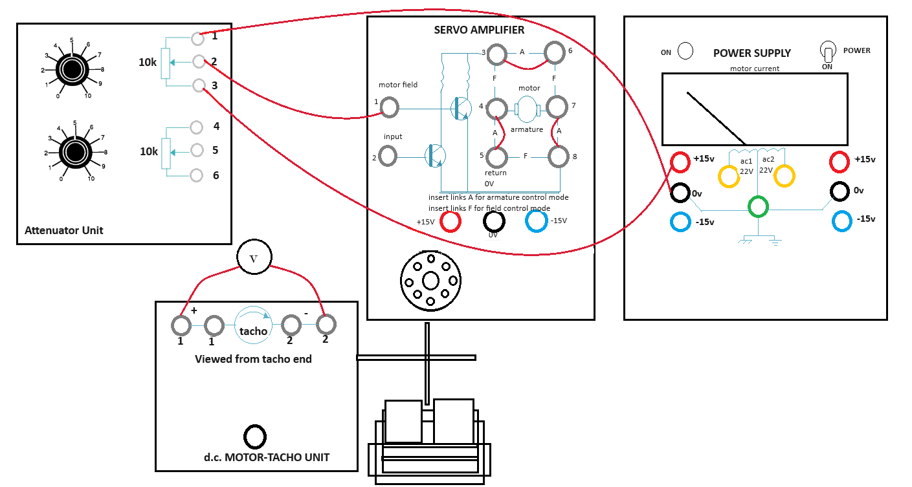

### Procedure

**Steps to perform the simulation**

<b>Find Tacho Generator Constant</b>

<b>Fig. 1. Wire Connection for finding Tacho Generator Constant</b>

								

1. First connect the circuit diagram properly through the connecting dots (black dots) according to the instructions below.

Attenuator Unit upper potentiometer point 1 - Power Supply 0 V (left one), Attenuator Unit upper potentiometer point 3 - Power Supply +15 V (left one),
Attenuator Unit upper potentiometer point 2 - Servo Amplifier point 1, Servo Amplifier point (3-6, 4-5, 7-8).

2. Click on 'Check Connection' button to check whether the connection is proper or not. Click on the 'Power' switch in Power Supply box ,the led will glow.

3. Rotate the upper potentiometer knob in Attenuator Unit. Observe the tacho generator voltage in the black box above dc motor tacho unit plate. Rotate the knob untill the tacho generator voltage is about 1 V and motor starts rotating, observe the speed of the motor.

4. Now click on 'Show Table' button to get the observation data. Check output around 2, 3, 4 and 5 volts of tacho generator following steps 3-4 and click on 'Show Table' button each time after increasing the voltage.

5. Click on 'Plot' button to observe the plot 'Motor Speed (rpm) Vs. Tacho generator voltage (Volts)' and calculate the tacho generator constant (<i>k</i>g)
from the slope in 'Motor Speed (rpm) Vs. Tacho generator voltage (Volts)' plot as shown in Fig. 2. Enter the value of <i>k</i>g in corresponding box beside observation table. Click on 'Download Plot' button to download the plot.

<b>Fig. 2. Calculation of Tacho Generator Constant (<i>k</i>g)</b>

								
				

6. Rotate the potentiometer knobs to its minimum value to stop the motor, switch off the power. Click on 'Clear' button.

 
<b>Speed Control (Open Loop and Closed Loop)</b>

<b>Fig. 3. Wire Connection for Closed Loop Speed Control</b>

1. First connect the circuit diagram properly through the connecting dots (black dots) according to the instructions below.

Attenuator Unit lower potentiometer point 4 - Op Amp Unit 0 V, Attenuator Unit lower potentiometer point 5 - Op Amp Unit point 2,

Attenuator Unit lower potentiometer point 6 - Op Amp Unit -15 V, Op Amp Unit point 6 (upper one) - Servo Amplifier point 1,

Servo Amplifier point (3-6, 4-5, 7-8), Op Amp Unit +15 V - Power Supply +15 V (left one), Op Amp Unit -15 V - Power Supply -15 V (left one),

Op Amp Unit 0 V - Power Supply 0 V (left one), DC motor tacho unit lower point - Power Supply 0 V, DC motor tacho unit lower point - DC motor tacho unit point 2 (first one).

2. Click on 'Check Connection' button to check whether the connection is proper or not. Click on the 'Power' switch in Power Supply box, the led will glow.

3. Rotate the lower potentiometer knob in Attenuator Unit. Observe the reference voltage, error voltage and Speed. Rotate the knob untill the motor starts rotating at around 2000 rpm. Observe the tacho generator voltage in the black box above dc motor tacho unit plate. Click on 'Show Table' button to get the observation data.

4. Now click on the plus sign on 'Brake Change' to set the magnetic braking (loading) arrangement to point 2. Observe the change in speed and tacho generator voltage. 

5. Now click on 'Show Table' button to observe the observation table. Change brake position from 2-10 in step of 2 and check speed, tacho generator voltage following step 4 and click on 'Show Table' button each time after changing brake position.

6. Now click on 'Plot' button to observe the plot 'Motor Speed (rpm) Vs. Braking Load (units)'. Click on 'Download Plot' button to download the plot.

7. Rotate the potentiometer knobs to its minimum value to stop the motor, switch off the power. Click on 'Clear' button.

8. Now make the circuit connection following step 1 and connect the velocity error feedback (Op Amp Unit point 3 - DC motor tacho unit point 1 (first one)) for closed loop control and follow steps 2-6 again.

9. Click on 'Pre amplifier Characteristics' button to observe the characteristics of the pre amplifier , click on 'Position Control' button to perform the experiment of controlling the position of the motor rotor. To perform the experiment of controlling the speed of the motor click on 'Speed Control' button.

<b>Pre Amplifier Characteristics</b>

<b>Fig 4. Wire Connection for Pre Amplifier Characteristics</b>

1. First connect the circuit diagram properly through the connecting dots (black dots) according to the instructions below.

Attenuator Unit upper potentiometer point 1 - lower potentiometer point 4, Attenuator Unit upper potentiometer point 2 - lower potentiometer point 6,

Attenuator Unit upper potentiometer point 3 - Pre Amplifier Unit +15 V, Attenuator Unit upper potentiometer point 1 - Pre Amplifier Unit 0 V,

Attenuator Unit lower potentiometer point 5 - Pre Amplifier Unit point 1, Power Supply +15 V (left one) - Pre Amplifier Unit +15 V, Power Supply -15 V (left one) - Pre Amplifier Unit -15 V,

Power Supply 0 V (left one) - Pre Amplifier Unit 0 V					  

2. Click on 'Check Connection' button to check whether the connection is proper or not. Then click on the 'Power' switch in Power Supply box, the led will glow.

3. Rotate the lower potentiometer knob in Attenuator Unit. Observe the input voltage in the black box above.
Rotate the knob untill the voltage is about +1.5 V, the Pre Amplifier outputs Vo(3) and Vo(4) are shown in respective boxes.

4. Click on 'Show Table' button to get the observation data. Rotate the lower potentiometer knob anti clockwise to decrease the input voltage upto 0 value and click on 'Show Table' button each time after decreasing the voltage in 0.1 V step.

5. Now change the connection to apply -15 V as supply voltage. This can be achieved by deleting the connection Attenuator Unit upper potentiometer point 3 - Pre Amplifier Unit +15 V by clicking on the 
connected wire and connecting Attenuator Unit upper potentiometer point 3 - Pre Amplifier Unit -15 V.
Click on 'Check Connection' button to make sure that proper connection has been done.

6. Now Rotate the lower potentiometer knob in Attenuator Unit in clockwise direction. Observe the input voltage in the black box above. Rotate the knob to increase the voltage in -0.1 V step untill -1.5 V, the Pre Amplifier outputs Vo(3) and Vo(4) are shown in respective boxes. Click on 'Show Table' button each time after increasing the voltage.

7. After the total procedure (steps 3-6) is complete for +1.5 V to -1.5 V input voltage, click on 'Plot' button to observe the plot 'Pre Amplifier output voltages (Vo(3) and Vo(4)) (Volts) Vs. Input voltage (Vi) (Volts)'. Hover on the plot section, click on the camera icon to download the plot. 

8. Rotate the potentiometer knob to its minimum value ,switch off the power. Click on 'Clear' button.

9. Click on 'Position Control' button to perform the experiment of controlling the position of the motor rotor. Click on 'Pre Amplifier Characteristics' button to observe the characteristics of the Pre Amplifier , to perform the experiment of controlling the speed of the motor click on 'Speed Control' button.

<b>Position Control</b>

<b>Fig. 5. Wire Connection for Position Control</b>

1. First connect the circuit diagram properly through the connecting dots (black dots) according to the instructions below.

Attenuator Unit upper potentiometer point 1 - Pre Amplifier Unit 0 V, Attenuator Unit upper potentiometer point 2 - Pre Amplifier Unit point 1,	

Attenuator Unit upper potentiometer point 3 - Op Amp Unit point 6 (lower one), Pre Amplifier Unit point 3 - Servo Amplifier point 1,

Pre Amplifier Unit point 4 - Servo Amplifier point 2, Op Amp Unit +15 V - Input Potentiometer point 2, Op Amp Unit -15 V - Input Potentiometer point 1,

Op Amp Unit point 1 - Input Potentiometer point 3, Power Supply +15 V (right one) - Output Pot Unit point 1, Power Supply -15 V (right one) - Output Pot Unit point 2,

Op Amp Unit point 2 - Output Pot Unit point 3 (first one), Op Amp Unit +15 V - Servo Amplifier +15 V, Op Amp Unit -15 V - Servo Amplifier -15 V, Op Amp Unit 0 V - Servo Amplifier 0 V,

Servo Amplifier point (3-6, 4-5, 7-8), Pre Amplifier Unit +15 V - Power Supply +15 V (left one), Pre Amplifier Unit -15 V - Power Supply -15 V (left one), Pre Amplifier Unit 0 V - Power Supply 0 V (left one).

2. Click on 'Check Connection' button to check whether the connection is proper or not. Click on the 'Power' switch in Power Supply box, the led will glow.

3. Rotate the upper potentiometer knob in Attenuator Unit upto 8. Click on 'Rotate Pot' button clockwise arrow sign to rotate Input Potentiometer cursor to an arbitrary angle (ex:+10&deg;). Observe the output potentiometer (Output Pot Unit) cursor angle. Click on 'Show Table' button to get the observation data, observe the misalignment there.

4. Now take 5 readings for different angles in clockwise direction following step 3 and click on 'Show Table' button each time after changing input cursor angle.

5. Now click on 'Rotate Pot' button counter clockwise arrow sign to rotate Input Potentiometer cursor to an arbitrary angle (ex:-10&deg;). Observe the output potentiometer cursor angle. Click on 'Show Table' button to get the observation data, observe the misalignment there.

6. Now take 5 readings for anticlockwise rotation following step 5 and click on 'Show Table' button each time after changing input cursor angle. 

7. Rotate the upper potentiometer knob to its minimum value, switch off the power. Click on 'Clear' button.

8. To perform the experiment of controlling the speed of the motor click on 'Speed Control' button. Click on 'Pre Amplifier Characteristics' button to observe the characteristics of the Pre Amplifier , click on 'Position Control' button to perform the experiment of controlling the position of the motor rotor.

  