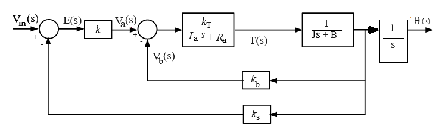

# Theory

<b>DC Machine :</b> 

In the dc machine, the field winding is placed on the stator and the armature winding on the rotor. A dc current is passed through the field winding to produce flux in the machine. Voltage induced in the armature winding is alternating. A mechanical commutator and a brush assembly function as a rectifier or inverter, make the armature terminal voltage unidirectional.

<b>Fig. 1. Cross section view of a dc machine</b>

 <b>Application :</b>

Although a dc machine can be operated as either a generator or a motor, at present its use as a generator is limited because of the wide spread use of ac power. The dc machine is extensively used as a motor in industry. Its speed can be controlled over a wide range with relative ease. Large dc motors (in tens or hundreds of horsepower) are used in machine tools, printing presses, fans, pumps, hoists, cranes, paper mills, textile mills, rolling mills and so forth. Additionally, dc motors still dominate as traction motors used in transit cars and locomotives. Small dc machines (in fractional horsepower rating) are used primarily as control devices, such as tachogenerators for speed sensing and servomotors for positioning and tracking.
The dc machine definitely plays an important role in industry.

<b>Speed Control of DC Motors :</b>

The term 'speed control' stands for intentional speed variation, carried out manually or automatically. Natural speed change due to load, is not included in the term 'speed control'. DC motors are most suitable for wide range speed control and are therefore indispensable for many adjustable speed drives. The speed of a dc motor is given by below equation.

$$\omega = \frac{V_t - I_a r_a}{K_a \Phi}$$

where 

$$K_a = \frac{PZ}{2\pi A}$$

Where  
<i>&omega;</i> = Angular speed of the dc motor 
<i>Vt</i> = Terminal voltage of dc motor 
<i>Ia</i> = Armature current of dc motor 
<i>ra</i> = Armature resistance of dc motor 
<i>P</i> = Number of poles of dc motor 
<i>Z</i> = Number of armature conductors of dc motor 
<i>A</i> = Number of parallel paths of dc motor 
&Phi; is the magnetic flux  

There are basically three methods of speed control and these are : 

(i) Variation of resistance in the armature circuit 
(ii) Variation of the field flux  
(iii) Variation of the armature terminal voltage  

Before describing these methods, it is preferable to define the terms base speed, speed	regulation, speed range, constant power drive and constant torque drive. 

<b>Base Speed :</b> 
It is defined as the speed at which a motor runs at rated armature voltage and rated field current. Base speed is equal to the rated speed or nameplate speed of the motor.

  <b>Speed regulation :</b> 
If the speed-change from no load to full load is &Delta;<i>&omega;m</i> then speed regulation is defined as the ratio of 
&Delta;<i>&omega;m</i> to rated speed (or base speed) <i style="font-family:'Bodoni MT'">&omega;m</i>

$$The \ percentage \ speed \ regulation \ = \ \frac{\Delta \omega_m}{\omega_m}\times 100$$

  <b>Speed range</b> 
It is defined as the ratio of the maximum allowable speed to minimum allowable speed of the motor. When the speed range of a motor is specified, it must be mentioned 
whether this speed range is at no-load, full load or a fraction of full load. 

  <b>Constant power drive :</b> 
If the motor shaft power (shaft torque &times speed) remains constant over a given speed range, the system is called a constant power drive. In constant 
power drive, higher torques are available at lower speeds and lower torques at higher speeds. The motor size is always decided by the highest torque requirement at the lowest speed.

  <b>Constant torque drive :</b> 
If the motor shaft torque remains constant over a given speed range, the system is called a constant torque drive. In constant torque drive, shaft 
power varies as the speed varies.

  <b>Magnetic Braking :</b> 

Conventional braking systems in cars and bicycles utilise the friction force between two objects pressed together to slow an object down. By making use of eddy currents,
magnetic braking can be achieved where the electromagnetic force between a magnet and a conductor in motion is used to create a repulsive and slowing force. If a conductor moves
past a stationary magnet, eddy currents will be induced in the conductor by the magnet, according to Faraday’s law of induction. Eddy currents create their own magnetic field that
opposes the original magnetic field of the magnet. This in turn creates a drag force between the magnet and the conductor, which slows the conductor down.
A permanent magnet or an electromagnet can be used to create the magnetic field in a magnetic brake. A big advantage with magnetic braking is the lack of physical contact
between components. A disadvantage with magnetic braking is that when there is no motion between the magnet and conductor,
there is no static force to maintain the conductor at rest. In this case, the magnetic braking system would need to be supplemented by a friction based (conventional) braking system
like a hand brake.

<b>Speed Control :</b>

There are numerous applications where control of speed is required, as in rolling mills, cranes, hoists, elevators, machine tools, transit system and locomotive drives. DC motors are extensively used in many of these applications. Control of the speed of dc motors below and above the base (or rated) speed can easily be achieved. Besides, the methods of control are simpler and less expensive than those applicable to ac motors. In the classical method, a Ward–Leonard system with rotating machines is used for speed control of dc motors. Recently, solid-state converters have been used for this purpose. In this section, various methods of speed control of dc motors are discussed.

In order to achieve wider speed control range, speeds below base speed are obtained by voltage control and above base speed by field flux control.

<b>1. Armature voltage control (Va) :</b> 
In the armature voltage control mode, the speed control is carried out with rated armature current and constant motor field flux. A constant torque upto base speed is obtained.
Power (torque &times; speed) increases in proportion to speed. Thus constant torque and variable power drive is obtained upto base speed 
with armature terminal voltage control method as shown in fig 2. 

 <b>2. Field current control (If) :</b> 

The field current control mode is used to obtain speed above the base speed. In this mode, the	armature voltage Va remains constant and 
the motor field current <!--Ifm--> is decreased (field weakening) to obtain higher speeds. The armature current can be kept constant, there by operating the motor in a constant horsepower mode. The torque obviously decreases as speed
increases.  Thus constant power and variable torque drive is obtained above base speed 
with field current control method as shown in Fig. 2. 

 <b>3. Armature resistance control method</b> 
The armature resistance control is based on the principle that the speed of the motor is directly proportional to the back emf.
So, if the supply voltage and the armature resistance are kept at a constant value, the speed of the motor will be directly proportional to the armature current. 

 
<b> Fig. 2. DC Motor speed control methods graphical analysis</b>

 

Besides these there are other speed control methods like ward leonard system , Solid-state control using choppers and controlled rectifiers etc.

  <b>Open loop speed control:</b> 

As shown in Fig. 3 , the armature-controlled dc motor is itself a feedback system, where back emf voltage is proportional to the speed of the motor.
The system may be arranged in input-output form such that <i style="font-family:'Bodoni MT'">Va</i>(s) is the input and 
<i>&omega;</i>(s) is the output.  

The mathematical expression for open loop speed control is,

$$\omega(s) = \frac{\frac{ k_T}{R_a J}}{\frac{L_a}{R_a}s^2 + (1 + \frac{B L_a}{R_a J} )s + \frac{k_T k_b + R_a B}{R_a J}} V_{a}(s)$$

The ratio <i style="font-family:'Bodoni MT'">La/ Ra</i> is called the motor electric-time constant, which makes the system speed response transfer function second order
and is denoted by <i style="font-family:'Bodoni MT';font-size:18px">&tau;e</i>.	<i style="font-family:'Bodoni MT'">La</i> in the armature circuit is very small, 
<i style="font-family:'Bodoni MT';font-size:18px">&tau;e</i> is neglected, resulting in the simplified transfer function of the system. Thus, the speed of the motor shaft may be simplified to

$$\omega(s) = \frac{\frac{k_T}{R_a J}}{s + \frac{k_T k_b + R_a B}{R_a J}}V_a(s)$$

<b>Fig. 3. Block diagram of an  armature-controlled dc motor for open loop speed control</b>

 

 <b>Closed loop speed control :</b> 

 DC motors are extensively used in many drives where speed control is desired. In many applications where a constant speed is required, open-loop operation of dc motors may not be
satisfactory. In open-loop operation, if load torque changes, the speed will change too. In a closed-loop system, the speed can be maintained constant by adjusting the motor terminal
voltage as the load torque changes. 

There are other advantages of closed-loop operation, such as greater accuracy, improved dynamic response and stability of operation. In a closed-loop system the drive characteristics
can also be made to operate at constant torque or constant horsepower over a certain speed range, a requirement in traction systems. Circuit protection can also be provided
in a closed-loop system. In fact, most industrial drive systems operate as closed-loop feedback systems. 

<b>Fig. 4. Block diagram of closed loop speed control of an armature-controlled dc motor </b>

 

The mathematical expression for closed loop speed control is,

$$\omega(s) = \frac{\frac{k k_T k_g}{R_a J}}{s + (\frac{k_T k_b + R_a B + k_g k_T k}{R_a J})} \omega_{in}(s)$$

assuming <i style="font-family:'Bodoni MT'">La</i> = 0 

Where, 

<i style="font-family:'Bodoni MT'">J</i> = Moment of inertia of the motor in kg-m2 
<i style="font-family:'Bodoni MT'">B</i> = Viscous-friction coefficient of the motor in N-m/rad/sec 
<i style="font-family:'Bodoni MT';font-size:18px">k</i><i style="font-family:'calibri'">g</i> = Tachogenerator constant 
<i style="font-family:'Bodoni MT';font-size:18px">k</i> = Pre amplifier gain 
<i style="font-family:'Bodoni MT';font-size:18px">k</i><i style="font-family:'Bodoni MT';">T</i> = Motor torque constant 
<i style="font-family:'Bodoni MT';font-size:18px">kb</i> = Back emf constant 
<i style="font-family:'Bodoni MT'">Ra</i> = Armature resistance in &ohm; 
<i style="font-family:'Bodoni MT'">La</i> = Armature inductance in  henry 
<i style="font-family:'Bodoni MT'">Va</i> = Applied armature voltage in volts 

 <b>Closed loop position control :</b> 
To control the position of the motor shaft, the simplest strategy is to use a proportional controller with gain <i>k</i>. The block diagram of the closed-loop system is shown in figure below.
The system is composed of an angular position sensor (usually an encoder or a potentiometer for position applications). For simplicity, the input voltage can be scaled 
to a position input <i style="font-family:'Bodoni MT'">&theta;in</i>(s) so that the input and output have the same units and scale. Alternatively, the output can be converted into voltage using the sensor gain value. The
closed-loop transfer function in this case becomes,

$$\frac{\theta(s)}{\theta_{in}(s)} = \frac{\frac{k k_T k_s}{R_a J}}{s^2 + (\frac{R_a B + k_T k_b}{R_a J})s +\frac{k k_T k_s}{R_a J}}$$

<i style="font-family:'Bodoni MT';font-size:18px">ks</i> = Sensor gain 

<b>Fig. 5. Block diagram of position control of an armature-controlled dc motor </b>

 			

<b> Important Equations of a dc motor :</b> 

Let us consider <i style="font-family:'Bodoni MT'">V</i> is the supply voltage, <i style="font-family:'Bodoni MT'">Eb</i> is the back emf produced and 
<i style="font-family:'Bodoni MT'">Ia, Ra</i> are the armature current and armature resistance respectively of a dc motor.
Then the voltage equation is given by,

$$V = E_b + I_a R_a ----(1)$$ 

we multiply both sides of equation (1) by <i style="font-family:'Bodoni MT'">Ia</i>

$$V I_a = E_b I_a + I_a^{2} R_a ----(2)$$ 

Now <i style="font-family:'Bodoni MT'">Ia2Ra</i> is the power loss due to heating of the armature coil and the true effective mechanical power that is required to produce the desired torque of dc machine
is given by,

$$p_m = E_b I_a -----------(3)$$

The mechanical power <i style="font-family:'Bodoni MT';font-size:18px">pm</i> is related to the electromagnetic torque <i>Tg</i> as,

$$p_m = T_g \omega -----------(4)$$

Where, <i style="font-family:'Bodoni MT';font-size:18px">&omega;</i> is speed in rad/sec. Now equating equation (3) and (4) we get,

$$E_b I_a = T_g \omega -----------(5)$$

For simplifying the torque equation of dc motor we substitute.

$$E_b = \frac{P \phi Z N}{60A} -----------(6)$$ 

Substituting equation (5) and (6) in equation (3), we get:

$$T_g = \frac{P \phi Z I_a}{2\pi A} -----------(7)$$ 

This is the torque equation of dc motor. It can be further simplified as:

$$T_g = K_a \ \phi I_a$$

where,

$$K_a = \frac{PZ}{2 \pi A}$$ 

Where, 

<i style="font-family:'Bodoni MT'">P</i> is number of poles of the dc motor, 
<i>&Phi;</i> is flux per pole, 
<i style="font-family:'Bodoni MT'">Z</i> is number of conductors of the dc motor, 
<i style="font-family:'Bodoni MT'">A</i> is number of parallel paths of the dc motor, 
and <i style="font-family:'Bodoni MT'">N</i> is the speed of the dc motor in rpm

						
								